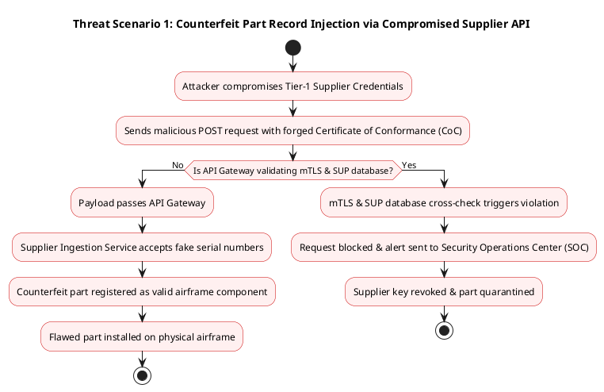
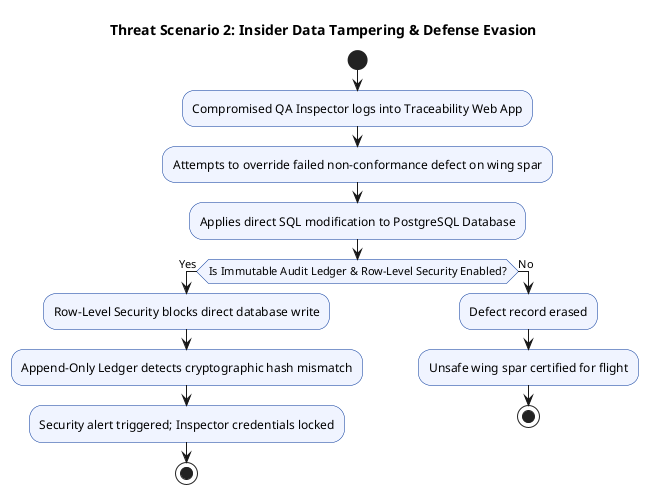

# (S2-25_SSABZG681) Advanced Cyber Security Assignment
## Cyber Security Risk Analysis & System Design Report: Serialized Airframe Traceability System

**Student Name :** *Dhirendra Singh*
**Student ID :** *2024AB12523*
**Professional Experience :** *5 Years*
**Current Role :** *Engineer*
**Industry Domain :** *Aerospace & Defense Manufacturing*
**System Selected :** Serialized Airframe Traceability System
**System Type :** *Simulated*
**Confidentiality Statement :** This report does not disclose proprietary or sensitive organizational information.

---

## 1. EXECUTIVE SUMMARY

### 1.1 Business Purpose & Operational Scope
In modern aerospace manufacturing, producing a physical aircraft is only half the process; the other half is creating a complete, tamper-proof digital record of every single part installed on that airframe. The As-Built "Digital Twin" & Serialized Airframe Traceability Database serves as the central repository for an aircraft manufacturing facility.\

When an aircraft rolls off the assembly line, regulatory authorities (such as the FAA or EASA) will not issue an Airworthiness Certificate unless the manufacturer can prove the exact lineage, supplier credentials, serial numbers, and quality testing history for thousands of critical parts—from multi-million-dollar jet engines and composite wing spars down to individual structural titanium bolts.\

The Digital Twin system ingests real-time data from shop-floor barcode and RFID scanners, quality inspection stations, supplier delivery portals, and enterprise resource planning (ERP) platforms. It continuously builds a virtual twin of the physical aircraft currently under construction.

### 1.2 Core Security Objectives
Because this system forms the basis of physical flight safety and compliance with international trade laws, security is paramount:

1. **Integrity (Highest Priority):** Guaranteeing that no internal actor, compromised supplier, or external hacker can alter component histories, erase defects, swap real serial numbers for fake ones, or artificially modify the life-cycle limits of safety-critical components.
2. **Confidentiality (High Priority):** Protecting proprietary stealth geometries, defense capability specs, and supplier pricing data from industrial espionage, unauthorized foreign nationals, or nation-state adversaries (enforcing strict ITAR/EAR export compliance).
3. **Availability (Moderate-to-High Priority):** Ensuring the database is continuously operational during factory shifts so assembly lines do not grind to a halt due to an inability to log component installations.

### 1.3 High-Level Threat & Risk Profile
The system faces several severe threat vectors:

* **Counterfeit / Suspect Unapproved Parts (SUP) Injection:** Fraudulent suppliers or malicious insiders altering database records to register unapproved, low-quality parts as certified aerospace components.
* **Insider Data Tampering:** Compromised technicians or contractors attempting to clear failed quality inspections by modifying test logs or part statuses directly in the database.
* **Export Control Violations:** Unauthorized foreign entities accessing restricted defense airframe configurations via misconfigured API endpoints.
* **Ransomware / Extortion:** Adversaries encrypting the Digital Twin database right before final delivery, holding millions of dollars in completed aircraft hostage until a ransom is paid.

### 1.4 Strategic Security Posture & Safeguards
To counter these threats, the proposed architecture implements a **Zero-Trust Defense-in-Depth Model**. Key controls include Mutual TLS (mTLS) for all factory scanners and external APIs, cryptographic write-only ledgering (append-only audit trails) for every serial number update, Attribute-Based Access Control (ABAC) to enforce strict ITAR citizenship requirements, and Hardware Security Modules (HSM) for signing certification records.

---

## SECTION 3: B.2 ANCHOR - SYSTEM AND THREAT SURFACE BLUEPRINTING
--------------------------------------------------------------

### 3.1 System Description

The **As-Built Digital Twin & Serialized Airframe Traceability Database** is an enterprise-grade aerospace manufacturing system that maintains the authoritative, real-time "as-built" bill-of-materials (BOM) and digital replica for active airframes.

*   **Primary Users:**
    
    1.  _Assembly Technicians:_ Factory floor operators using handheld wireless barcode/RFID scanners to link physical serial numbers to specific airframe coordinates.
        
    2.  _Quality Control Inspectors:_ QA engineers auditing installation logs, non-conformance reports (NCRs), and signing off on structural milestones.
        
    3.  _ITAR & Security Auditors:_ Compliance officers reviewing access logs, citizenship verification attributes, and data export events.
        
    4.  _Tier-1 Aerospace Suppliers:_ External vendors submitting Certificates of Conformance (CoCs), material test reports, and serialized part manifests.
        
    5.  _Federal Aviation Regulators (FAA/EASA):_ External safety authorities receiving cryptographically signed digital airworthiness documentation packages.
        
*   **Business Function & Operational Importance:**The system acts as the single source of truth for aircraft structural integrity and legal flight qualification. An unrecorded component or an unverified serial number directly prevents FAA Airworthiness Certification, resulting in factory delivery freezes, multi-million-dollar inventory holding costs, and severe regulatory penalties under FAA Part 21/45 and AS9100 Rev D standards.
    

### 3.2 Runtime Architecture

The system employs a hybrid cloud/edge deployment model designed to maintain zero-trust security without impeding high-throughput shop-floor assembly operations.

*insert image runtime architecture flow chart svg image*

*   **Edge Gateway & Factory Network:** High-density WPA3 Enterprise wireless network dedicated to rugged shop-floor mobile tools. Traffic is terminated at an Edge API Gateway performing Mutual TLS (mTLS) device certificate authentication.
    
*   **Microservices Application Tier:** Containerized Kubernetes services processing ingestion requests. Go services handle high-speed scanner payloads, Java Spring Boot handles core Digital Twin state transitions and ABAC policy enforcement, and Python FastAPI handles supplier document parsing.
    
*   **Data Storage & HSM Vault:** Dual-storage strategy using PostgreSQL with Row-Level Security (RLS) for active relational query trees and AWS QLDB (or equivalent append-only cryptographic ledger) for immutable audit records. Cryptographic signatures for FAA forms are generated via an onboard FIPS 140-3 Level 3 Hardware Security Module (HSM).
    

### 3.3 C4 Architecture Diagrams

#### 3.3.1 C4 Level 1: System Context Diagram

**Sequential Context Overview:** At the highest level, the System Context diagram establishes the system boundaries and external actors. It illustrates how primary users (Assembly Technicians, QA Inspectors, Compliance Officers) and external entities (Tier-1 Suppliers, ERP Systems, and FAA/EASA Regulators) interact with the core As-Built Digital Twin System over distinct secure communications protocols.

*Insert l1 system context image*

#### 3.3.2 C4 Level 2: Container Diagram

**Sequential Container Overview:** Zooming into the As-Built Digital Twin System boundary defined in Level 1, the Container diagram reveals the core executable applications, microservices, and storage subsystems. It decomposes the overall platform into an Edge API Gateway, web/mobile APIs, domain microservices (Go, Java, Python), data repositories (PostgreSQL DB, QLDB Ledger), and Hardware Security Modules (HSM).

*Insert l2 system context image*

#### 3.3.3 C4 Level 3: Component Diagram for Scanner Ingestion Service

**Sequential Component Overview:** Zooming into a single critical container from Level 2—the high-throughput **Scanner Ingestion Service**—the Component diagram details its internal modular structure. It demonstrates how incoming scanner requests sequentially pass through an API Receiver, Payload Validator, Device Identity Verifier, and Anti-Replay Engine before being emitted to the Kafka event bus and security audit log.

*Insert l3 system context image*

### 3.4 Data Flow Mapping

*convert table in gemini chat then insert markdown format table*

### 3.6 Regulatory and Compliance Boundary

The system operates across several rigorous legal and aerospace regulatory frameworks:

*   **ITAR (22 CFR Parts 120-130) & EAR (15 CFR Parts 730-774):**
    
    *   _Boundary:_ Any system module processing defense airframe geometries, composite layering, or weapon mounting hardpoints.
        
    *   _Enforcement:_ Attribute-Based Access Control (ABAC) dynamically restricts data queries to verified U.S. citizens/permanent residents. Network perimeter controls block non-U.S. IP blocks.
        
*   **FAA Part 21/45 & EASA Part 21 (Airworthiness & Identification):**
    
    *   _Boundary:_ Serial number tracking from initial receiving inspection through final assembly sign-off.
        
    *   _Enforcement:_ Mandates complete component traceability. Enforced via the Immutable Audit Ledger, which prevents deletion or retroactive alteration of part installation logs.
        
*   **AS9100 Revision D (Aerospace Quality Management):**
    
    *   _Boundary:_ Shop-floor inspection records and non-conformance disposition workflows.
        
    *   _Enforcement:_ Supplier Ingestion Service cross-references vendor credentials and material batches against FAA Suspect Unapproved Parts (SUP) databases before granting entry to the assembly pipeline.
        
*   **NIST SP 800-171 (Protecting CUI in Nonfederal Systems):**
    
    *   _Boundary:_ Enterprise IT infrastructure handling Controlled Unclassified Information (CUI).
        
    *   _Enforcement:_ End-to-end encryption (AES-256 at rest, TLS 1.3 in transit), FIPS-validated cryptographic modules, and multi-factor authentication (MFA) on all administrative sessions.

---

## SECTION 4: DATA CLASSIFICATION & REGULATORY MAPPING

To protect critical information and comply with international regulations, data within the system is categorized according to sensitivity:

| Data Asset Category | Sensitivity Level | Examples | Regulatory Mandate | Encryption Requirement |
| :--- | :--- | :--- | :--- | :--- |
| **Airframe Geometry & Structural Blueprints** | Strictly Confidential / Restricted | Stealth composite CAD models, spar thickness specs | ITAR/EAR | AES-256 (At Rest), TLS 1.3 (In Transit), HSM-backed |
| **Component Serial Numbers & Lineage** | High Confidentiality / High Integrity | Engine turbine serials, wing bolt torque logs | FAA Part 21/45, AS9100 Rev D | AES-256 + Cryptographic Append-Only Ledger |
| **Supplier Certificates of Conformance (CoC)** | Confidential | Vendor test certificates, material batch mill test reports | AS9100 Rev D, NIST SP 800-171 | Encrypted DB, Digitally Signed Digests |
| **Assembly Worker Scan Logs** | Internal Operational | Technician ID, shift timestamp, tool ID | OSHA, Internal Audit Policies | Standard Encryption At Rest & In Transit |
| **Finalized Airworthiness Records** | Regulatory Mandatory | Signed FAA Form 8130-3 digital packages | FAA Part 21, EASA Part 21 | HSM PKCS#11 Signed, WORM Storage |

---

## SECTION 5: CIA TRIAD ANALYSIS & IMPACT MATRIX

The Security Impact Analysis defines priorities for maintaining core security principles across the system:

```
[1] INTEGRITY       ==========================> CRITICAL (10/10)
[2] CONFIDENTIALITY ======================> HIGH (9/10)
[3] AVAILABILITY    =================> MODERATE (7/10)
```

### Detailed Justification:

1. **Integrity (Priority 1 - Critical):**
   * **Impact of Failure:** If an adversary or corrupt worker alters a component serial number or clears a defective part record, a compromised or counterfeit component could be installed on an active aircraft. This could cause catastrophic structural failure, loss of life, or global grounding of the aircraft fleet.

2. **Confidentiality (Priority 2 - High):**
   * **Impact of Failure:** Unauthorized exposure of serialized component maps or material specifications could leak sensitive defense technology to foreign state actors, resulting in severe ITAR violations, massive federal fines, and loss of government defense contracts.

3. **Availability (Priority 3 - Moderate-to-High):**
   * **Impact of Failure:** System downtime halts assembly lines because technicians cannot proceed without logging installations. While costly in terms of factory downtime, it does not immediately cause physical structural failure in flight.

---

## SECTION 6: THREAT MODELING & ATTACK SCENARIOS

### 6.1 MITRE ATT&CK Mapping Matrix

| Attack Phase | MITRE ID | Technique Name | Threat Scenario Application |
| :--- | :--- | :--- | :--- |
| **Initial Access** | T1190 | Exploit Public-Facing Application | Adversary targets external Supplier API Gateway with payload injection. |
| **Execution** | T1059 | Command and Scripting Interpreter | Attacker attempts remote code execution on Scanner Ingestion microservice. |
| **Persistence** | T1098 | Account Manipulation | Rogue contractor creates elevated accounts in the Digital Twin DB. |
| **Privilege Escalation** | T1068 | Exploitation for Privilege Escalation | Exploiting weak ABAC checks to gain ITAR-exempt permissions. |
| **Defense Evasion** | T1562 | Impair Defenses | Insider attempts to disable audit logging before altering part defect status. |
| **Credential Access** | T1552 | Unsecured Credentials | Attacker extracts hardcoded API keys from factory scanner firmware binaries. |
| **Lateral Movement** | T1210 | Exploitation of Remote Services | Moving from compromised Wi-Fi scanner network to backend PostgreSQL core. |
| **Impact** | T1485 | Data Destruction / Tampering | Overwriting structural bolt inspection histories to cover up manufacturing flaws. |

---

### 6.2 Threat Scenario 1: Unapproved Counterfeit Part Injection via Compromised Supplier API



* **Description:** A rogue or compromised Tier-1 supplier attempts to upload forged material certificates for substandard titanium bolts.
* **Mitigation:** The Supplier API Gateway cross-references incoming serial numbers against federal Suspect Unapproved Parts (SUP) registries and requires hardware-backed mTLS certificates.

---

### 6.3 Threat Scenario 2: Insider Privilege Escalation & Audit Log Manipulation



* **Description:** A technician attempts to erase a non-conformance record to hit delivery deadlines.
* **Mitigation:** Cryptographic append-only ledgering ensures that records cannot be altered or deleted, maintaining an immutable audit history.

---

## SECTION 7: DEFENSE-IN-DEPTH CONTROL ARCHITECTURE

The Defense-in-Depth strategy incorporates layered security controls across all system tiers:

```
========================================================================================
| DEFENSE-IN-DEPTH LAYERS                                                              |
========================================================================================
| [Layer 1: Perimeter / Edge]   --> WAF, ITAR IP Filtering, DDoS Protection             |
| [Layer 2: Network / Access]   --> mTLS, WPA3 Enterprise, Segmented VLANs             |
| [Layer 3: Application]        --> ABAC, Schema Validation, JWT Validation            |
| [Layer 4: Data / Storage]     --> Cryptographic Immutable Ledger, AES-256            |
| [Layer 5: Key Management]     --> FIPS 140-3 Level 3 Hardware Security Module        |
========================================================================================
```

1. **Perimeter Security:** Web Application Firewall (WAF) filtering incoming requests, blocking non-US IP blocks for ITAR-restricted endpoints.
2. **Network Segmentation:** Physical isolation of factory floor WPA3 Enterprise Wi-Fi networks from corporate management networks via internal firewalls.
3. **Application Control:** Attribute-Based Access Control (ABAC) validating nationality, security clearance level, and shift assignment before granting read/write access.
4. **Data Integrity Safeguards:** Writes committed to both relational storage (PostgreSQL) and a cryptographically chained append-only ledger (AWS QLDB or equivalent).
5. **Key Management:** Private keys for signing airworthiness certifications stored exclusively within a dedicated Hardware Security Module (HSM).

---

## SECTION 8: CVSS VULNERABILITY SCORING & REMEDIATION

### Vulnerability Analysis: Unauthenticated API Access to Part Lineage Endpoint

* **Vector String:** `CVSS:3.1/AV:N/AC:L/PR:N/UI:N/S:U/C:H/I:H/A:N`
* **Base Score:** 9.1 (CRITICAL)

| CVSS v3.1 BREAKDOWN SCORE | METRIC VALUE |
| :--- | :--- |
| **Attack Vector (AV)** | Network (N) |
| **Attack Complexity (AC)** | Low (L) |
| **Privileges Required (PR)** | None (N) |
| **User Interaction (UI)** | None (N) |
| **Scope (S)** | Unchanged (U) |
| **Confidentiality (C)** | High (H) |
| **Integrity (I)** | High (H) |
| **Availability (A)** | None (N) |
| **FINAL CVSS SCORE** | **9.1 / 10 (CRITICAL)** |

### Remediation Action Plan:
1. **Immediate Action:** Enforce mTLS client certificate validation at the API Gateway layer.
2. **Short-Term Fix:** Implement Attribute-Based Access Control (ABAC) checks inside the Scanner Ingestion Service.
3. **Long-Term Control:** Require HSM digital signatures for all state-changing serial number commits.

---

## SECTION 9: REFLECTION & STRATEGIC RECOMMENDATIONS

Designing a cybersecurity architecture for an aerospace manufacturing system requires balancing high-throughput operational requirements on the factory floor with zero-trust safety and compliance regulations.

### Key Strategic Lessons:
1. **Integrity-First Design:** In aerospace, integrity is tied directly to physical human safety. Security models must prioritize cryptographic proof of history over traditional access logging.
2. **Export Control Convergence:** Cybersecurity architectures must integrate legal compliance (ITAR/EAR) directly into API authorization checks (ABAC).
3. **Defense Beyond the Enterprise:** Extending the trust boundary to Tier-1 suppliers requires automated cross-verification with external government safety databases.

---

## APPENDIX: KEY JARGON & CONCEPTS EXPLAINED

To make this technical document accessible across all engineering and management tiers, key aerospace and security terms are defined below in simple terms:

* **Digital Twin:** A precise digital replica of a physical airplane. As workers screw parts onto the real plane on the factory floor, the exact same parts are registered into this digital software model.
* **Airframe Traceability:** The ability to trace every single part on an airplane backward to where it was made, who made it, when it was inspected, and who installed it.
* **Airworthiness Certificate:** The official government permit issued by aviation authorities (like the FAA) that allows a newly built airplane to legally fly. Without complete traceability data, this permit cannot be granted.
* **Suspect Unapproved Parts (SUP):** Counterfeit, fake, stolen, or substandard parts that do not meet strict aviation safety rules.
* **ITAR (International Traffic in Arms Regulations) / EAR (Export Administration Regulations):** United States government defense laws that make it a federal crime to share certain military or high-tech aircraft blueprints with non-US citizens or unvetted foreign companies.
* **AS9100:** The global quality management standard created specifically for the aerospace industry to ensure high quality and traceability.
* **C4 Architecture Model:** A visual way of showing how software works by zooming in from high-level views (Context) to detailed components (Containers and Code).
* **Mutual TLS (mTLS):** A high-security connection where both the computer server AND the hardware device (e.g., a hand-held scanner) check each other's digital passports/certificates before exchanging sensitive data.
* **API Gateway:** A single, heavily guarded digital entrance that inspects, cleans, and verifies every request coming into the backend systems.
* **Append-Only Audit Log:** A database setup where info can only be added, never modified or deleted. If a mistake is made, a correction entry is added, preserving the original record forever.
