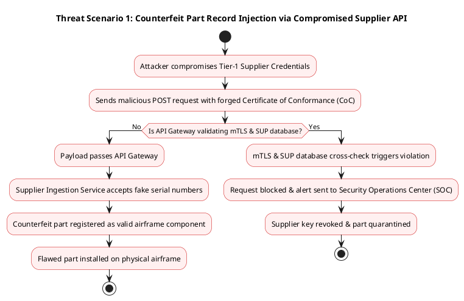
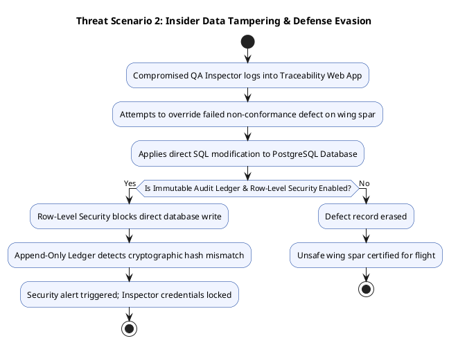

# CYBERSECURITY ARCHITECTURE & THREAT MODEL REPORT
## As-Built "Digital Twin" & Serialized Airframe Traceability Database

---

### COVER PAGE

* **Course Title:** Advanced Cyber Security Architecture & Threat Modeling
* **Document Title:** Cyber Security Risk Analysis & System Design Report: As-Built "Digital Twin" & Serialized Airframe Traceability System
* **Target System:** As-Built Digital Twin & Serialized Airframe Traceability Database
* **Industry Sector:** Aerospace Manufacturing & Defense
* **Regulatory Domain:** FAA Part 21/45, AS9100 Rev D, ITAR (22 CFR 120-130), EAR (15 CFR 730-774), NIST SP 800-171
* **Document Version:** 1.0
* **Classification:** Highly Confidential / Export Controlled (ITAR/EAR Controlled Data Simulation)
* **Date:** August 13, 2026

---

## SECTION 1: EXECUTIVE SUMMARY

### 1.1 Business Purpose & Operational Scope
In modern aerospace manufacturing, producing a physical aircraft is only half the process; the other half is creating a complete, tamper-proof digital record of every single part installed on that airframe. The As-Built "Digital Twin" & Serialized Airframe Traceability Database serves as the central repository for an aircraft manufacturing facility.

When an aircraft rolls off the assembly line, regulatory authorities (such as the FAA or EASA) will not issue an Airworthiness Certificate unless the manufacturer can prove the exact lineage, supplier credentials, serial numbers, and quality testing history for thousands of critical parts—from multi-million-dollar jet engines and composite wing spars down to individual structural titanium bolts.

The Digital Twin system ingests real-time data from shop-floor barcode and RFID scanners, quality inspection stations, supplier delivery portals, and enterprise resource planning (ERP) platforms. It continuously builds a virtual twin of the physical aircraft currently under construction.

### 1.2 Core Security Objectives
Because this system forms the basis of physical flight safety and compliance with international trade laws, security is paramount:

1. **Integrity (Highest Priority):** Guaranteeing that no internal actor, compromised supplier, or external hacker can alter component histories, erase defects, swap real serial numbers for fake ones, or artificially modify the life-cycle limits of safety-critical components.
2. **Confidentiality (High Priority):** Protecting proprietary stealth geometries, defense capability specs, and supplier pricing data from industrial espionage, unauthorized foreign nationals, or nation-state adversaries (enforcing strict ITAR/EAR export compliance).
3. **Availability (Moderate-to-High Priority):** Ensuring the database is continuously operational during factory shifts so assembly lines do not grind to a halt due to an inability to log component installations.

### 1.3 High-Level Threat & Risk Profile
The system faces several severe threat vectors:

* **Counterfeit / Suspect Unapproved Parts (SUP) Injection:** Fraudulent suppliers or malicious insiders altering database records to register unapproved, low-quality parts as certified aerospace components.
* **Insider Data Tampering:** Compromised technicians or contractors attempting to clear failed quality inspections by modifying test logs or part statuses directly in the database.
* **Export Control Violations:** Unauthorized foreign entities accessing restricted defense airframe configurations via misconfigured API endpoints.
* **Ransomware / Extortion:** Adversaries encrypting the Digital Twin database right before final delivery, holding millions of dollars in completed aircraft hostage until a ransom is paid.

### 1.4 Strategic Security Posture & Safeguards
To counter these threats, the proposed architecture implements a **Zero-Trust Defense-in-Depth Model**. Key controls include Mutual TLS (mTLS) for all factory scanners and external APIs, cryptographic write-only ledgering (append-only audit trails) for every serial number update, Attribute-Based Access Control (ABAC) to enforce strict ITAR citizenship requirements, and Hardware Security Modules (HSM) for signing certification records.

---

## SECTION 2: KEY JARGON & CONCEPTS EXPLAINED

To make this technical document accessible across all engineering and management tiers, key aerospace and security terms are defined below in simple terms:

* **Digital Twin:** A precise digital replica of a physical airplane. As workers screw parts onto the real plane on the factory floor, the exact same parts are registered into this digital software model.
* **Airframe Traceability:** The ability to trace every single part on an airplane backward to where it was made, who made it, when it was inspected, and who installed it.
* **Airworthiness Certificate:** The official government permit issued by aviation authorities (like the FAA) that allows a newly built airplane to legally fly. Without complete traceability data, this permit cannot be granted.
* **Suspect Unapproved Parts (SUP):** Counterfeit, fake, stolen, or substandard parts that do not meet strict aviation safety rules.
* **ITAR (International Traffic in Arms Regulations) / EAR (Export Administration Regulations):** United States government defense laws that make it a federal crime to share certain military or high-tech aircraft blueprints with non-US citizens or unvetted foreign companies.
* **AS9100:** The global quality management standard created specifically for the aerospace industry to ensure high quality and traceability.
* **C4 Architecture Model:** A visual way of showing how software works by zooming in from high-level views (Context) to detailed components (Containers and Code).
* **Mutual TLS (mTLS):** A high-security connection where both the computer server AND the hardware device (e.g., a hand-held scanner) check each other's digital passports/certificates before exchanging sensitive data.
* **API Gateway:** A single, heavily guarded digital entrance that inspects, cleans, and verifies every request coming into the backend systems.
* **Append-Only Audit Log:** A database setup where info can only be added, never modified or deleted. If a mistake is made, a correction entry is added, preserving the original record forever.

---

## SECTION 3: ARCHITECTURE & SYSTEM DESIGN (C4 MODEL)

### 3.1 C4 Level 1: System Context Diagram
The System Context diagram illustrates how the As-Built Digital Twin System sits at the center of the aircraft manufacturing ecosystem, showing external actors, physical shop-floor devices, external suppliers, and regulatory bodies.

```plantuml
@startuml Context
!include https://raw.githubusercontent.com/plantuml-stdlib/C4-PlantUML/master/C4_Context.puml
LAYOUT_WITH_LEGEND()

title System Context Diagram [C4 Level 1] - As-Built Digital Twin & Traceability System

Person(assemblyTech, "Assembly Technician", "Factory worker installing physical airframe components and scanning barcode/RFID tags.")
Person(qaInspector, "Quality Inspector", "Quality control engineer reviewing non-conformance reports and approving airworthiness steps.")
Person(complianceOfficer, "ITAR / Security Auditor", "Monitors data access for ITAR compliance and regulatory airworthiness verification.")

System(digitalTwinSystem, "As-Built Digital Twin System", "Central platform managing the exact serialized configuration, supplier lineage, and digital twin state.")

System_Ext(supplierPortal, "Tier-1 Supplier System", "External supplier portal pushing Certificate of Conformance (CoC) and part serial numbers.")
System_Ext(erpSystem, "Enterprise ERP System", "Enterprise resource planning platform managing overall work orders and billing.")
System_Ext(faaPortal, "FAA / Regulatory System", "Aviation authority system receiving finalized airworthiness digital records upon completion.")

Rel(assemblyTech, digitalTwinSystem, "Logs component scans & torque logs", "mTLS / Encrypted Wi-Fi")
Rel(qaInspector, digitalTwinSystem, "Approves inspections & flags defects", "HTTPS / SAML 2.0 + MFA")
Rel(complianceOfficer, digitalTwinSystem, "Audits ITAR logs & serial histories", "HTTPS / SAML 2.0 + MFA")
Rel(supplierPortal, digitalTwinSystem, "Submits part manifests & certs", "HTTPS / mTLS REST API")
Rel(digitalTwinSystem, erpSystem, "Syncs component bill-of-materials (BOM)", "Internal Secure gRPC")
Rel(digitalTwinSystem, faaPortal, "Exports finalized Airworthiness Records", "Encrypted SFTP / AS2")
@enduml
```

#### Detailed Description of Context Elements & Trust Boundaries:
1. **Assembly Technician Boundary:** Operates inside the factory floor via rugged wireless handheld scanners. Represents a high-volume data ingestion trust boundary (untrusted mobile network to trusted factory edge).
2. **Quality Control & Auditor Boundary:** Internal corporate intranet access using strict multi-factor authentication (MFA) and Role-Based Access Control (RBAC).
3. **External Tier-1 Supplier Boundary:** Represents a high-risk external trust boundary. External corporate networks push data into the manufacturing boundary via a secured REST API.
4. **FAA/Regulatory Boundary:** Outbound trust boundary where legally binding, cryptographically signed airworthiness packages are transmitted to federal regulators.

### 3.2 C4 Level 2: Container Diagram
The Container diagram zooms into the As-Built Digital Twin System to highlight its high-level technical building blocks, storage mechanisms, and communication protocols.

```plantuml
@startuml Containers
!include https://raw.githubusercontent.com/plantuml-stdlib/C4-PlantUML/master/C4_Container.puml
LAYOUT_WITH_LEGEND()

title Container Diagram [C4 Level 2] - As-Built Digital Twin & Traceability System

Person(tech, "Shop-Floor Tech", "Scans parts with handhelds")
Person(admin, "QA / Compliance Admin", "Manages records & ITAR flags")

System_Boundary(digitalTwinBoundary, "As-Built Digital Twin Core Boundary") {
    Container(apiGateway, "API Gateway / Edge Router", "NGINX / Kong", "Handles mTLS termination, rate limiting, ITAR IP filtering, and request authentication.")
    Container(webApp, "Traceability Web App", "React / TypeScript", "Provides QA inspectors and auditors with interactive 3D digital twin visualization and record review.")
    Container(mobileApi, "Scanner Ingestion Service", "Go / Microservice", "Processes high-speed barcode/RFID scans from factory floor tools.")
    Container(coreTwinService, "Digital Twin Engine", "Java / Spring Boot", "Core logic managing component hierarchy, serial relationships, and life-cycle validation.")
    Container(supplierIngestService, "Supplier Data Ingestion", "Python / FastAPI", "Parses and validates external supplier certificates, cross-referencing SUP databases.")
    
    ContainerDb(relationalDb, "Configuration Database", "PostgreSQL (Encrypted)", "Stores structured serialized part trees, work order statuses, and airframe baselines.")
    ContainerDb(auditLedger, "Immutable Audit Ledger", "QLDB / Append-Only Ledger", "Cryptographically verifiable ledger logging every single addition, update, or status change.")
    Container(hsm, "Hardware Security Module (HSM)", "Cloud/On-Prem HSM", "Stores cryptographic root keys used to digitally sign export records and airworthiness packages.")
}

Rel(tech, apiGateway, "Pushes part scans", "mTLS over WPA3 Enterprise")
Rel(admin, webApp, "Views digital twin & approves parts", "HTTPS / TLS 1.3")
Rel(webApp, apiGateway, "API Calls", "HTTPS / JSON")
Rel(apiGateway, mobileApi, "Routes scanner data", "Internal gRPC")
Rel(apiGateway, coreTwinService, "Routes user requests", "Internal gRPC")
Rel(apiGateway, supplierIngestService, "Routes supplier payloads", "Internal gRPC")
Rel(mobileApi, coreTwinService, "Sends part updates", "Async Message Bus (Kafka)")
Rel(supplierIngestService, coreTwinService, "Sends verified vendor parts", "Async Message Bus (Kafka)")
Rel(coreTwinService, relationalDb, "Reads/Writes part state", "Encrypted SQL (mTLS)")
Rel(coreTwinService, auditLedger, "Appends cryptographic audit logs", "TLS 1.3 API")
Rel(coreTwinService, hsm, "Requests cryptographic signatures", "PKCS#11 / Secure API")
@enduml
```

#### Breakdown of Container Components:
1. **API Gateway / Edge Router:** Single security checkpoint. Terminates Mutual TLS (mTLS), enforces rate limits, filters traffic by nationality/IP for ITAR compliance, and verifies JWT tokens.
2. **Scanner Ingestion Service:** Microservice in Go built to ingest high-volume barcode/RFID scans from factory tools without latency.
3. **Digital Twin Engine:** Core service enforcing aerospace business rules (e.g., ensuring a part cannot be assigned to two airframes at once). Enforces Attribute-Based Access Control (ABAC).
4. **Supplier Data Ingestion Microservice:** Validates incoming Certificates of Conformance against Suspect Unapproved Parts (SUP) registries.
5. **Configuration Database (PostgreSQL):** Stores active relational structures linking physical aircraft to component trees. Encrypted at rest via AES-256 with Row-Level Security (RLS).
6. **Immutable Audit Ledger:** Cryptographically linked append-only ledger guaranteeing zero deletion or unauthorized modification of part histories.
7. **Hardware Security Module (HSM):** FIPS 140-3 Level 3 hardware vault managing private keys used to sign FAA airworthiness submissions.

---

## SECTION 4: DATA CLASSIFICATION & REGULATORY MAPPING

To protect critical information and comply with international regulations, data within the system is categorized according to sensitivity:

| Data Asset Category | Sensitivity Level | Examples | Regulatory Mandate | Encryption Requirement |
| :--- | :--- | :--- | :--- | :--- |
| **Airframe Geometry & Structural Blueprints** | Strictly Confidential / Restricted | Stealth composite CAD models, spar thickness specs | ITAR/EAR | AES-256 (At Rest), TLS 1.3 (In Transit), HSM-backed |
| **Component Serial Numbers & Lineage** | High Confidentiality / High Integrity | Engine turbine serials, wing bolt torque logs | FAA Part 21/45, AS9100 Rev D | AES-256 + Cryptographic Append-Only Ledger |
| **Supplier Certificates of Conformance (CoC)** | Confidential | Vendor test certificates, material batch mill test reports | AS9100 Rev D, NIST SP 800-171 | Encrypted DB, Digitally Signed Digests |
| **Assembly Worker Scan Logs** | Internal Operational | Technician ID, shift timestamp, tool ID | OSHA, Internal Audit Policies | Standard Encryption At Rest & In Transit |
| **Finalized Airworthiness Records** | Regulatory Mandatory | Signed FAA Form 8130-3 digital packages | FAA Part 21, EASA Part 21 | HSM PKCS#11 Signed, WORM Storage |

---

## SECTION 5: CIA TRIAD ANALYSIS & IMPACT MATRIX

The Security Impact Analysis defines priorities for maintaining core security principles across the system:

```
[1] INTEGRITY       ==========================> CRITICAL (10/10)
[2] CONFIDENTIALITY ======================> HIGH (9/10)
[3] AVAILABILITY    =================> MODERATE (7/10)
```

### Detailed Justification:

1. **Integrity (Priority 1 - Critical):**
   * **Impact of Failure:** If an adversary or corrupt worker alters a component serial number or clears a defective part record, a compromised or counterfeit component could be installed on an active aircraft. This could cause catastrophic structural failure, loss of life, or global grounding of the aircraft fleet.

2. **Confidentiality (Priority 2 - High):**
   * **Impact of Failure:** Unauthorized exposure of serialized component maps or material specifications could leak sensitive defense technology to foreign state actors, resulting in severe ITAR violations, massive federal fines, and loss of government defense contracts.

3. **Availability (Priority 3 - Moderate-to-High):**
   * **Impact of Failure:** System downtime halts assembly lines because technicians cannot proceed without logging installations. While costly in terms of factory downtime, it does not immediately cause physical structural failure in flight.

---

## SECTION 6: THREAT MODELING & ATTACK SCENARIOS

### 6.1 MITRE ATT&CK Mapping Matrix

| Attack Phase | MITRE ID | Technique Name | Threat Scenario Application |
| :--- | :--- | :--- | :--- |
| **Initial Access** | T1190 | Exploit Public-Facing Application | Adversary targets external Supplier API Gateway with payload injection. |
| **Execution** | T1059 | Command and Scripting Interpreter | Attacker attempts remote code execution on Scanner Ingestion microservice. |
| **Persistence** | T1098 | Account Manipulation | Rogue contractor creates elevated accounts in the Digital Twin DB. |
| **Privilege Escalation** | T1068 | Exploitation for Privilege Escalation | Exploiting weak ABAC checks to gain ITAR-exempt permissions. |
| **Defense Evasion** | T1562 | Impair Defenses | Insider attempts to disable audit logging before altering part defect status. |
| **Credential Access** | T1552 | Unsecured Credentials | Attacker extracts hardcoded API keys from factory scanner firmware binaries. |
| **Lateral Movement** | T1210 | Exploitation of Remote Services | Moving from compromised Wi-Fi scanner network to backend PostgreSQL core. |
| **Impact** | T1485 | Data Destruction / Tampering | Overwriting structural bolt inspection histories to cover up manufacturing flaws. |

---

### 6.2 Threat Scenario 1: Unapproved Counterfeit Part Injection via Compromised Supplier API



* **Description:** A rogue or compromised Tier-1 supplier attempts to upload forged material certificates for substandard titanium bolts.
* **Mitigation:** The Supplier API Gateway cross-references incoming serial numbers against federal Suspect Unapproved Parts (SUP) registries and requires hardware-backed mTLS certificates.

---

### 6.3 Threat Scenario 2: Insider Privilege Escalation & Audit Log Manipulation



* **Description:** A technician attempts to erase a non-conformance record to hit delivery deadlines.
* **Mitigation:** Cryptographic append-only ledgering ensures that records cannot be altered or deleted, maintaining an immutable audit history.

---

## SECTION 7: DEFENSE-IN-DEPTH CONTROL ARCHITECTURE

The Defense-in-Depth strategy incorporates layered security controls across all system tiers:

```
========================================================================================
| DEFENSE-IN-DEPTH LAYERS                                                              |
========================================================================================
| [Layer 1: Perimeter / Edge]   --> WAF, ITAR IP Filtering, DDoS Protection             |
| [Layer 2: Network / Access]   --> mTLS, WPA3 Enterprise, Segmented VLANs             |
| [Layer 3: Application]        --> ABAC, Schema Validation, JWT Validation            |
| [Layer 4: Data / Storage]     --> Cryptographic Immutable Ledger, AES-256            |
| [Layer 5: Key Management]     --> FIPS 140-3 Level 3 Hardware Security Module        |
========================================================================================
```

1. **Perimeter Security:** Web Application Firewall (WAF) filtering incoming requests, blocking non-US IP blocks for ITAR-restricted endpoints.
2. **Network Segmentation:** Physical isolation of factory floor WPA3 Enterprise Wi-Fi networks from corporate management networks via internal firewalls.
3. **Application Control:** Attribute-Based Access Control (ABAC) validating nationality, security clearance level, and shift assignment before granting read/write access.
4. **Data Integrity Safeguards:** Writes committed to both relational storage (PostgreSQL) and a cryptographically chained append-only ledger (AWS QLDB or equivalent).
5. **Key Management:** Private keys for signing airworthiness certifications stored exclusively within a dedicated Hardware Security Module (HSM).

---

## SECTION 8: CVSS VULNERABILITY SCORING & REMEDIATION

### Vulnerability Analysis: Unauthenticated API Access to Part Lineage Endpoint

* **Vector String:** `CVSS:3.1/AV:N/AC:L/PR:N/UI:N/S:U/C:H/I:H/A:N`
* **Base Score:** 9.1 (CRITICAL)

| CVSS v3.1 BREAKDOWN SCORE | METRIC VALUE |
| :--- | :--- |
| **Attack Vector (AV)** | Network (N) |
| **Attack Complexity (AC)** | Low (L) |
| **Privileges Required (PR)** | None (N) |
| **User Interaction (UI)** | None (N) |
| **Scope (S)** | Unchanged (U) |
| **Confidentiality (C)** | High (H) |
| **Integrity (I)** | High (H) |
| **Availability (A)** | None (N) |
| **FINAL CVSS SCORE** | **9.1 / 10 (CRITICAL)** |

### Remediation Action Plan:
1. **Immediate Action:** Enforce mTLS client certificate validation at the API Gateway layer.
2. **Short-Term Fix:** Implement Attribute-Based Access Control (ABAC) checks inside the Scanner Ingestion Service.
3. **Long-Term Control:** Require HSM digital signatures for all state-changing serial number commits.

---

## SECTION 9: REFLECTION & STRATEGIC RECOMMENDATIONS

Designing a cybersecurity architecture for an aerospace manufacturing system requires balancing high-throughput operational requirements on the factory floor with zero-trust safety and compliance regulations.

### Key Strategic Lessons:
1. **Integrity-First Design:** In aerospace, integrity is tied directly to physical human safety. Security models must prioritize cryptographic proof of history over traditional access logging.
2. **Export Control Convergence:** Cybersecurity architectures must integrate legal compliance (ITAR/EAR) directly into API authorization checks (ABAC).
3. **Defense Beyond the Enterprise:** Extending the trust boundary to Tier-1 suppliers requires automated cross-verification with external government safety databases.

### Continuous Improvement Roadmap:
* **Phase 1 (Months 1–3):** Complete deployment of mTLS across all shop-floor handheld scanners.
* **Phase 2 (Months 4–6):** Integrate automated SUP cross-checking on all incoming supplier REST payloads.
* **Phase 3 (Months 7–12):** Transition all FAA export certification signing to FIPS 140-3 Level 3 Cloud HSM nodes.
